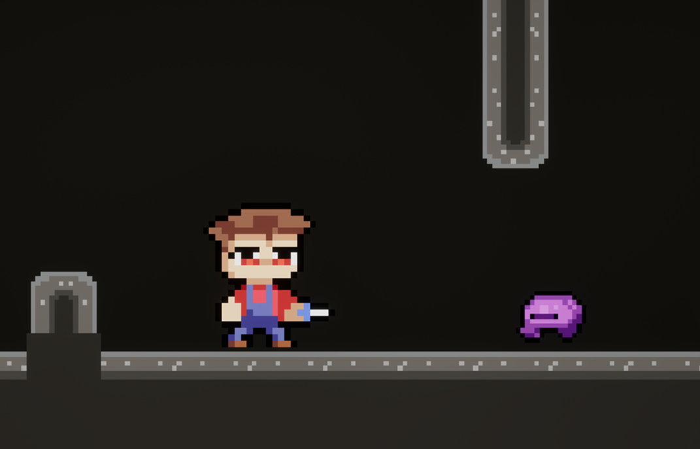
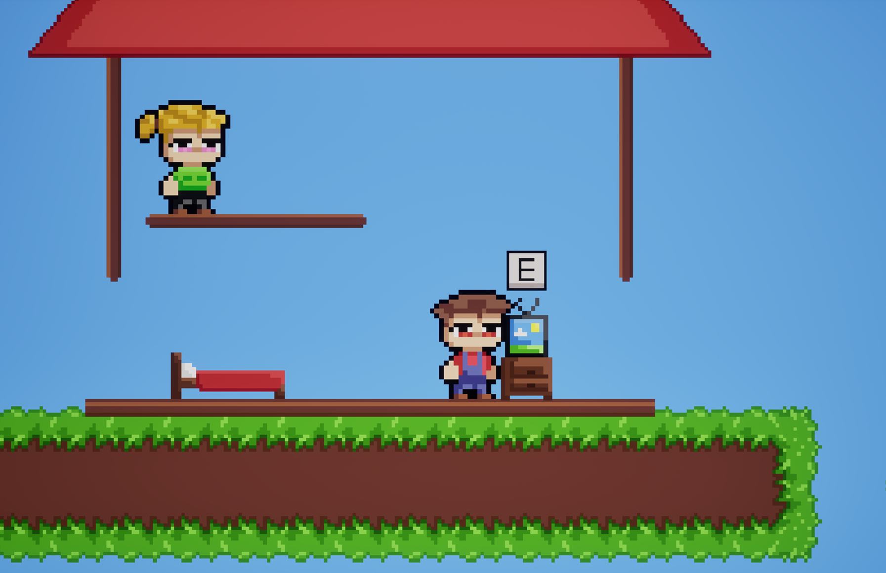
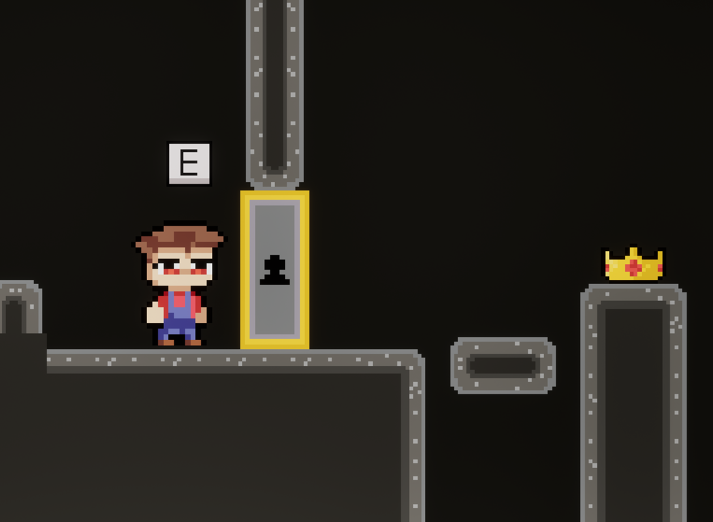

# Platform Farmer 🌿

A 2D platformer with exploration and resource gathering mechanics, built in Unreal Engine 5 using Paper2D.

---

## 🎮 Gameplay

Platform Farmer is a 2D platformer where the player explores a cave full of enemies, collects resources and tries to reach the crown hidden behind a locked door at the very bottom. To unlock it, you'll need to gather materials, trade with an NPC and upgrade your abilities — there are no shortcuts.

---

## 🧩 Features

| Feature | Description |
|---------|-------------|
| **Exploration** | Navigate through a multi-level cave full of slimes |
| **Resource gathering** | Collect plants, wood and other materials scattered across platforms |
| **NPC trading** | Buy a Key and a Double Jump upgrade from a merchant in exchange for gathered resources |
| **Progression gate** | The exit door requires a Key; the NPC requires materials; the NPC requires Double Jump to reach — everything connects |
| **Day/Night cycle** | At night all slimes respawn, keeping the cave dangerous and preventing the player from clearing it once and coasting |
| **Goal** | Reach the bottom of the cave, unlock the door, take the crown |

---

## 🕹️ Play

The game is available on itch.io: [jkaczor6.itch.io/platformfarmer](https://jkaczor6.itch.io/platformfarmer)

> Windows build. No installation required — unzip and run `PlatformFarmer.exe`.

---

## 🛠️ Tech Stack

- **Engine:** Unreal Engine 5 — Paper2D
- **Language:** C++
- **Platform:** Windows

---

## 🚀 Getting Started

### Prerequisites
- Unreal Engine 5.x
- Visual Studio 2022 (with C++ game development workload)

### Setup
```bash
git clone https://github.com/jkaczor6/PlatformFarmer.git
```
1. Open `PlatformFarmer.uproject` in Unreal Engine
2. When prompted, rebuild missing modules — confirm
3. Press Play in the editor

---

## 📸 Screenshots

| | |
|---|---|
|  |  |
|  |  |

---

## 📄 License

This project is open source and available under the [MIT License](LICENSE).

---

## 👤 Author

**Jakub Kaczor** — [Portfolio](https://jkaczor6.github.io/portfolio) · [GitHub](https://github.com/jkaczor6)
